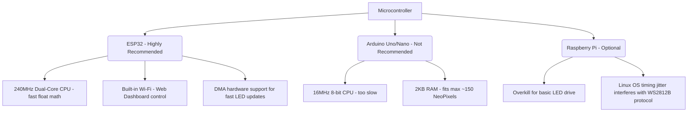

# Physical LED Flag: Architecture & Emulation Plan

This document outlines the design, hardware requirements, software structure, and emulation strategy for building a physical, animated LED flag.

---

## 1. Physical & Resolution Requirements

An American flag has specific proportions (1.9 width to 1.0 height). To render both the **13 stripes** and the **50 stars** in their correct grid layouts, we need to choose an appropriate LED layout.

### Option A: WS2812B NeoPixel Matrix (flexible or rigid panels)
- **Common Sizes:** $32 \times 8$, $16 \times 16$, or custom layouts built from strips.
- **Recommended Grid:** A $64 \times 32$ matrix (2048 LEDs) or a $32 \times 16$ matrix (512 LEDs).
  - *Why?* A vertical resolution of 16 or 32 rows allows the 13 stripes to render clearly.
  - The canton (union) occupies the top-left area ($x < 40\%$, $y > 53.8\%$). 
  - On a $64 \times 32$ grid:
    - Canton area is $25 \times 17$ pixels.
    - This offers enough pixels to map the 9-row by 11-column star grid ($6 \times 5$ alternating rows) using single pixels or tiny $2 \times 2$ pixel clusters for each star.
  - On a $32 \times 16$ grid:
    - Canton area is $12 \times 8$ pixels.
    - Since 9 rows of stars cannot fit into 8 vertical pixels without overlaps, a $32 \times 16$ grid would need to use a simplified star layout (e.g. fewer stars, or single-pixel dots representing stars).

### Option B: HUB75 RGB LED Panels (Highly Recommended)
- These are the panels used in outdoor billboards (e.g. $64 \times 32$ or $64 \times 64$ matrices).
- **Pros:** Extremely dense, cheap, high refresh rate, and professional look.
- **Cons:** Requires a dedicated library and slightly more complex wiring (16-pin ribbon cable) compared to 3-wire NeoPixels.

---

## 2. Hardware Recommendations

To drive the LED matrix with smooth, real-time procedural animations, we must select the right microcontroller:



### The Verdict: ESP32
- **CPU:** 32-bit dual-core at 240MHz. It has a hardware Floating Point Unit (FPU) to easily compute the sine, cosine, and HSV math.
- **RAM:** 520KB (can easily buffer tens of thousands of LEDs).
- **Connectivity:** Can run a local Web Server. We can build a mobile control panel matching our web app so you can control speed, themes, and colors directly from your phone!
- **Power Requirements:** 
  - LEDs run at 5V.
  - At full brightness white, a single NeoPixel draws ~60mA.
  - A $64 \times 32$ grid (2048 LEDs) can theoretically draw up to $2048 \times 0.06\text{A} = 122.8\text{A}$ at 100% white!
  - *Reality:* Running animated colored themes at 30% brightness draws around $5\text{A}$ to $8\text{A}$ ($25\text{W}$ - $40\text{W}$), which is easily powered by a standard 5V power supply.

---

## 3. Emulation Strategy: Web-First

Before buying hardware, we can emulate the physical LED flag directly inside our existing Vue WebGL project.

### How it will work:
We will add an **"LED Matrix Emulator Mode"** to our 3D Flag Canvas. When enabled:
1. **Pixelation:** The fragment shader will snap the high-resolution flag colors to a discrete grid of virtual LEDs (e.g. $64 \times 32$ or $32 \times 16$ resolution).
2. **LED Shape Simulation:** Instead of blending colors continuously, the shader will render individual round dots with dark gaps between them, representing physical LED pixels on a matrix panel.
3. **Twinkle & Glow:** The glow around the stars will blend through the pixel grid, showing exactly how the physical LEDs will light up.
4. **Interactive Controls:** You can change the emulated grid resolution ($32 \times 16$, $64 \times 32$, $128 \times 64$) from the sidebar dashboard to decide which hardware panel size looks best.

---

## 4. Software Porting (WebGL to C++ / Arduino)

Once the animations look perfect in the web emulator, we can port the GLSL code directly to C++ using the `FastLED` library:

| GLSL Shader Concept | ESP32 / C++ Code Equivalent |
| :--- | :--- |
| `vUv` (normalized coordinates) | `x / float(MATRIX_WIDTH)`, `y / float(MATRIX_HEIGHT)` |
| `sin(...)`, `cos(...)` | Standard C `sin(...)`, `cos(...)` (running on CPU) |
| `hsv2rgb(...)` | `FastLED`'s built-in `CHSV(hue, saturation, value)` helper |
| `uRainbowMode` | Flag variable toggle or `float` lerp factor |
| `stripeColor` index | `y` coordinate check against 13 stripe bands |
| Canton check | `x < CANTON_WIDTH && y > CANTON_HEIGHT` |

### ESP32 Main Loop Structure:
```cpp
#include <FastLED.h>

#define WIDTH 64
#define HEIGHT 32
#define NUM_LEDS (WIDTH * HEIGHT)
CRGB leds[NUM_LEDS];

// Equivalent to shader uniforms
float uTime = 0.0;
float uSpeed = 2.2;
float uAmplitude = 0.12;

void loop() {
  uTime = millis() / 1000.0;
  
  for(int y = 0; y < HEIGHT; y++) {
    for(int x = 0; x < WIDTH; x++) {
      float u = x / (float)WIDTH;
      float v = y / (float)HEIGHT;
      
      // 1. Calculate wave coordinates (emulates vertex displacement)
      float wave = sin(u * 4.5 - uTime * uSpeed) * cos(v * 2.5 - uTime * uSpeed) * uAmplitude;
      
      // 2. Fragment logic: check if in canton
      CRGB color;
      if (u < 0.4 && v > (6.0/13.0)) {
        color = getCantonPixel(u, v, wave, uTime);
      } else {
        color = getStripePixel(u, v, wave, uTime);
      }
      
      // 3. Map to 2D grid index (handles snake-like grid wiring)
      int ledIndex = getMatrixIndex(x, y);
      leds[ledIndex] = color;
    }
  }
  FastLED.show();
  delay(16); // ~60 FPS
}
```

---

## 5. Proposed Folder Structure for Monorepo

We will organize the code so you have everything in one place:

```
starsandstripes/
├── package.json
├── vite.config.js
├── web/                   <-- Current Vue 3 Web Application (WebGL Emulator)
│   ├── src/
│   │   ├── App.vue
│   │   ├── components/
│   │   │   └── FlagCanvas.vue
│   │   └── shaders/
│   │       └── flag.js
├── firmware/              <-- ESP32 C++ Code
│   ├── src/
│   │   ├── main.cpp
│   │   ├── shader_port.cpp
│   │   └── wifi_server.cpp
│   └── platformio.ini     <-- PlatformIO project configuration
└── docs/
    └── wiring_schematic.png
```

---

## 6. Next Steps

1. **Implement WebGL Emulator Toggle:** Add a slider/toggle in `App.vue` and `FlagCanvas.vue` to simulate $64 \times 32$ and $32 \times 16$ LED layouts.
2. **Review Physical Feasibility:** Confirm if you prefer a pre-built $64 \times 32$ panel (recommended) or want to stick individual strips together.
3. **Begin Firmware Skeleton:** Create the `firmware/` directory with a basic C++ template once you approve this architecture.
