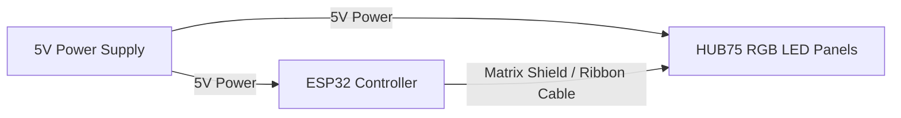

# Physical LED Flag: Hardware Shopping List

This shopping list outlines the exact components, quantities, and tools needed to build the physical animated LED flag. Choose **Option A** for a professional, high-density panel or **Option B** for a custom, hand-soldered layout.

---

## 1. Core Controller (Same for Both Options)

You need a powerful 32-bit microcontroller to handle the fast floating-point trigonometric wave shading and color transitions.

| Component | Qty | Specifications / Notes | Search Keywords |
| :--- | :---: | :--- | :--- |
| **ESP32 NodeMCU Development Board** | 1 | Choose the standard 30-pin or 38-pin ESP-WROOM-32 board. Do **not** get a standard 8-bit Arduino. | `ESP32 Development Board WROOM` |
| **Micro-USB or USB-C Cable** | 1 | For uploading code from your computer to the ESP32. | `USB C data cable fast charging` |

---

## 2. Option A: HUB75 LED Panels (Highly Recommended)
*This is the cleanest, easiest, and highest-resolution route. The panels come pre-assembled with a dense grid of LEDs.*

### Display & Driver Components
| Component | Qty | Specifications / Notes | Search Keywords |
| :--- | :--- | :--- | :--- |
| **HUB75 RGB LED Matrix Panels** | 2 | **For $128 \times 64$ Resolution:** Buy two $64 \times 64$ panels (Pitch 2.5mm or 3mm). **For $64 \times 32$ Resolution:** Buy one $64 \times 32$ panel. | `HUB75 RGB LED Matrix 64x64 P3` or `P2.5` |
| **ESP32 HUB75 Matrix Driver Shield** | 1 | A plug-and-play adapter board that slots onto the ESP32 and provides a ribbon cable header and screw terminals. (e.g. *ESP32 Trinity* by Brian Lough, or *Adafruit Matrix Portal ESP32*). | `ESP32 HUB75 driver board` or `Matrix Portal ESP32` |
| **16-pin HUB75 Ribbon Cable** | 1 | Usually comes free with the panels, but buy a spare if chaining panels. | `HUB75 ribbon cable 16pin` |
| **5V 10A / 20A Power Supply** | 1 | **For $64 \times 32$ (2,048 LEDs):** 5V 10A (50W) power supply. **For $128 \times 64$ (8,192 LEDs):** 5V 20A (100W) power supply (Mean Well is a reliable brand). | `5V 20A switching power supply Mean Well` |
| **DC Barrel Jack Adapter to Screw Terminals** | 1 | For connecting a brick-style power supply to the driver shield easily. | `5.5mm x 2.1mm DC power jack adapter` |

---

## 3. Option B: WS2812B Addressable LED Strips (DIY Route)
*This route allows you to build a custom-sized flag (e.g., the $74 \times 39$ layout with perfect integer stripes). Note: Requires a significant amount of cutting and soldering.*

### LED & Electronics Components
| Component | Qty | Specifications / Notes | Search Keywords |
| :--- | :--- | :--- | :--- |
| **WS2812B Addressable LED Strips** | ~3000 LEDs | **For $74 \times 39$ (2,886 LEDs):** Buy 5 meters of 60 LEDs/meter strips (approx. 10 rolls) or 144 LEDs/meter strips for a smaller, denser flag. | `WS2812B LED strip 60 leds/m 5m` |
| **74AHCT125 Level Shifter Chip** | 1 | Converts the ESP32's 3.3V data signal to the 5V logic signal required by the LED strips, preventing flickering. | `74AHCT125 level shifter DIP` |
| **5V 40A switching power supply** | 1 | Required to power 2,886 LEDs safely. | `5V 40A power supply 200W` |
| **1000µF 6.3V (or 10V) Capacitor** | 1 | Placed across the 5V and GND power terminals to prevent initial power surges from blowing the first LED. | `1000uF 10V electrolytic capacitor` |
| **330 Ohm Resistor** | 1 | Placed on the data line between the ESP32 pin and the first LED strip to protect the data pin. | `330 ohm resistor 1/4W` |

### Wiring & Mounting Tools (For Option B)
- **18 AWG Copper Wire (Red, Black, Yellow):** For running 5V power injection lines and data lines. (Do **not** use thin wire, it will melt under high current).
- **Soldering Iron & Solder (with Rosin core):** Essential for connecting the 39 strips in a "snake/zigzag" layout.
- **Hot Glue Gun or Double-Sided Foam Tape:** For mounting the LED strips onto a backing sheet (acrylic or wood panel).
- **Backing Board:** A sheet of white poster board or plywood sized $1.9 \times 1.0$ in aspect ratio (e.g. 95cm x 50cm).

---

## 4. Where to Buy

1. **AliExpress:** (Cheapest option, 2-week shipping). Best for HUB75 panels, ESP32 boards, and LED strips.
2. **Amazon:** (Fastest option, 1-2 days). Best for power supplies, wiring tools, resistors, capacitors, and Mean Well power modules.
3. **Adafruit / Pimoroni:** Great for premium, pre-built driver shields (like the *Adafruit Matrix Portal*) and high-quality mounting brackets.
